# Thomas Virdis · CTCycle

**Senior Data Scientist &amp; ML Engineer**

Building open-source systems where clinical AI, scientific computing, and machine learning meet.

[Project catalog](https://ctcycle.github.io/CTCycle/) · [LinkedIn](https://www.linkedin.com/in/thomas-virdis/) · [Medium](https://medium.com/@thomasvirdis)

  <code>clinical AI</code> · <code>reinforcement learning</code> · <code>scientific ML</code> · <code>LLM tooling</code>

---

## About

I am Thomas Virdis, also known as **CTCycle**. I build open-source tools for clinical and scientific workflows, from medical computer vision and clinical copilots to reinforcement-learning experiments, computational chemistry, and local-LLM tooling.

My current work is as a Senior Data Scientist and ML Engineer at **Inmatica S.p.A.** My path combines bachelor's and master's studies in Biotechnology at the University of Genoa with a PhD in Engineering Sciences at the Vrije Universiteit Brussel. During my PhD, I worked on **CheckPack**, developing micro-sensors for real-time food-spoilage and quality monitoring.

## Selected work

Four projects that represent the main areas of my engineering work:

| Project | Focus | Stack |
| --- | --- | --- |
| [FAIRS Roulette Player](https://github.com/CTCycle/FAIRS-Roulette-Player) | A local research workspace for DQN training and inference experiments, with dataset management, checkpoints, metrics, and session workflows. | `PyTorch` `FastAPI` `React` `Tauri` |
| [XREPORT Radiological Reports](https://github.com/CTCycle/XREPORT-radiological-reports-generator) | A client-server application for preparing datasets, training and validating models, and generating draft reports from X-ray images. | `Medical AI` `Transformers` `FastAPI` `React` |
| [ADSMOD Adsorption Modeling](https://github.com/CTCycle/ADSMOD-Adsorption-Modeling) | A scientific application for collecting adsorption data, fitting theoretical models, and training predictors from NIST and ARPA-E datasets. | `Python` `RDKit` `NumPy` `Pandas` |
| [LLMeter Local Benchmarks](https://github.com/CTCycle/LLMeter-local-benchmarks) | A Rust CLI for repeatable benchmarking of local OpenAI-compatible LLM providers, with performance metrics and exportable reports. | `Rust` `LLM evaluation` `CLI` |

## Current focus

- **Building:** Open-source ML tools for clinical research, medical imaging, reinforcement learning, computational chemistry, and LLM workflows.
- **Learning:** Front-end development and productionizing ML with Rust.
- **Collaborating:** On practical projects at the intersection of biotechnology, healthcare, and machine learning.
- **Ask me about:** Reinforcement learning, medical AI, or moving from biotechnology research into machine learning.

## Toolchain

| Area | Working stack |
| --- | --- |
| Languages | Python, Rust, Java, JavaScript, SQL, Bash |
| ML and deep learning | PyTorch, TensorFlow, Transformers, Hugging Face, LangChain |
| Infrastructure | Docker, Kubernetes, Linux, REST APIs, PostgreSQL |
| Scientific computing | RDKit, NumPy/SciPy, Pandas, NIST databases, ARPA-E |
| Workflow | Git, GitHub Actions, Jupyter, VS Code, Postman, CI/CD |

## Background

- **Now:** Senior Data Scientist and ML Engineer at Inmatica S.p.A., working on applied AI tools for clinical and scientific workflows.
- **Research:** PhD in Engineering Sciences at the Vrije Universiteit Brussel, including the CheckPack micro-sensor project.
- **Foundation:** Bachelor's and master's studies in Biotechnology at the University of Genoa.

## GitHub activity

These cards show public-repository activity only. GitHub Actions refreshes the repository-owned SVGs daily, so the profile does not depend on a live public stats endpoint at render time.

  
  

## Achievements

The Trophy cards are generated from the maintained [GitHub Profile Trophy](https://github.com/ryo-ma/github-profile-trophy) implementation and refreshed by the same repository-owned workflow.

  <a href="https://github.com/ryo-ma/github-profile-trophy">
    <picture>
      <source media="(prefers-color-scheme: dark)" srcset="./profile/trophy-dark.svg">
      
    </picture>
  </a>

## Connect

I am always interested in thoughtful collaborations involving biotechnology, healthcare, machine learning, and tools that help research move from experiment to usable software.

[LinkedIn](https://www.linkedin.com/in/thomas-virdis/) · [Medium](https://medium.com/@thomasvirdis/) · [Project catalog](https://ctcycle.github.io/CTCycle/)
